# Ứng dụng lập trình hướng đối tượng và Numpy trong Python để triển khai các thuật toán phân cụm mờ .
# 1.Giới thiệu:
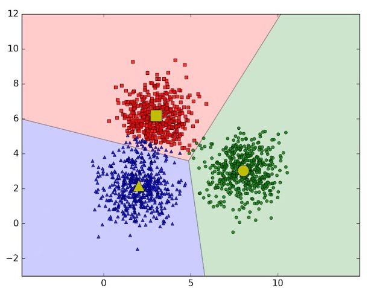

## - Thuật toán FCM (Fuzzy C-Means) là một phương pháp phân cụm thuộc nhóm clustering trong Machine Learning. 
## - FCM hoạt động dựa trên nguyên lý rằng mỗi điểm dữ liệu có thể thuộc về nhiều cụm với các mức độ khác nhau, được mô tả qua ma trận thành viên. Cập nhật các cụm và ma trận thành viên được thực hiện qua các bước lặp cho đến khi hội tụ.

# 2.Quy trình thực hiện FCM
## Bước 1: Khởi tạo
• Chọn số lượng cụm C( do người dùng chỉ định)
• Khởi tạo ngẫu nhiên các tâm cụm
• Khởi tạo ma trận thành viên u ngẫu nhiên, đảm bảo với tổng mức độ thành viên của một điểm dữ liệu trên tất cả các cụm bằng 1: 

## Bước 2:Cập nhật tâm cụm

## Trong đó: 
### • vj : là tâm cụm thứ j
### • uij: mức độ thành viên của điểm dữ liệu i đối với cụm j.
### • N:là số điểm dữ liệu
### • xi: điểm dữ liệu thứ i.
### • m:chỉ số  mờ.

## Bước 3 Cập nhật ma trận thành viên
## - Tính mức độ thành viên  cho từng điểm dữ liệu bằng công thức

## Trong đó: 
### • c là số cụm
### • xi: điểm dữ liệu thứ I
### • vj: tâm cụm thứ j
### • m: chỉ số mờ

## Bước 4:Kiểm tra điều kiện hội tụ:
### • Nếu ma trận thành viên U thay đổi không đáng kể (theo ngưỡng epsilon) hoặc số vòng lặp đạt mức tối đa, thì dừng thuật toán.
# 3. Cài đặt thuật toán bằng ngôn ngữ Python 
## a) Sử dụng thư viện numpy kết hợp với lập trình hướng đối tượng 
### • Nhập thư viện numpy 

### • Khai báo lớp FCM và hàm khởi tạo: 
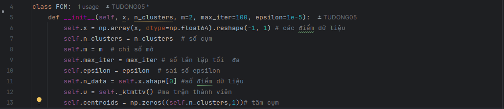 
### • Hàm khởi tạo ma trận thành viên ngẫu nhiên 

### • Hàm cập nhật tâm cụm 
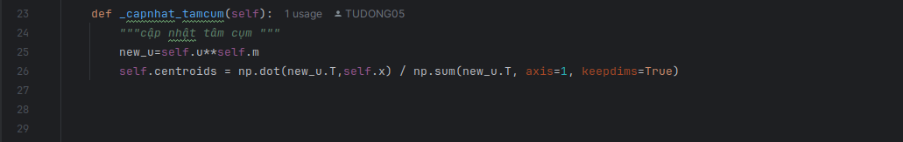
### • Hàm cập nhật ma trận thành viên 
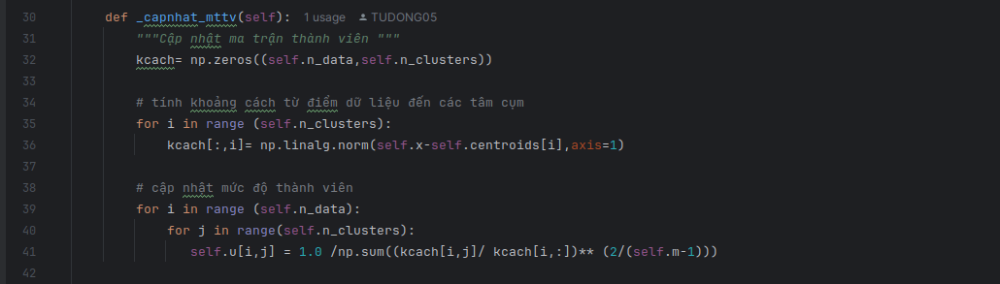
### • Hàm tính sự chênh lệch giữa ma trận thành viên cũ và ma trận thành viên mới 

### • Hàm triển khai thuật toán Fuzzy C-Means 

### • Truyền dữ liệu và thực hiện 
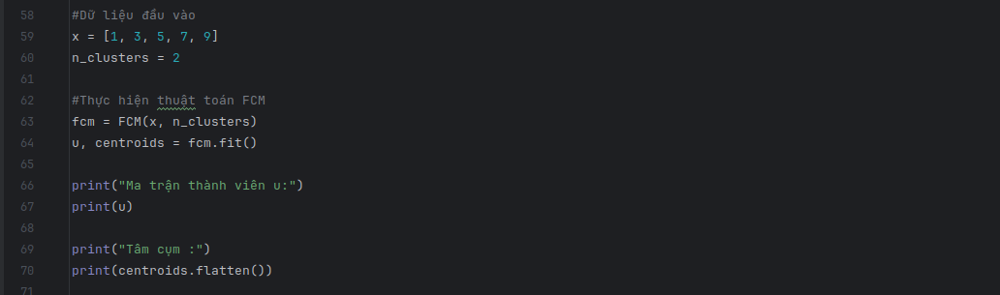
### • Kết quả thu được 
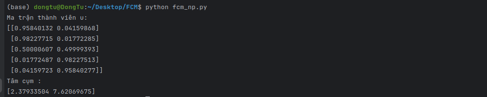

## b) Sử dụng vòng lặp for kết hợp với lập trình hướng đối tượng 
### • Nhập thư viện random 

### • Khai báo lớp FCM và hàm khởi tạo
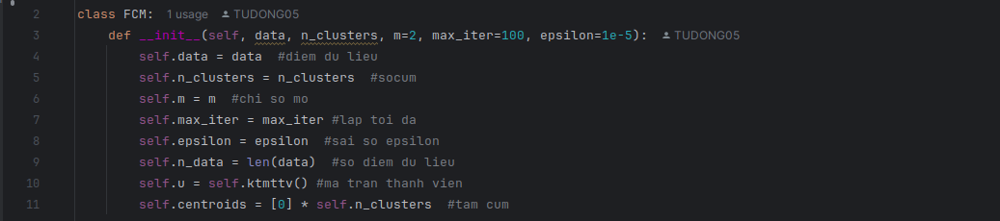
### • Hàm khởi tạo ma trận thành viên ngẫu nhiên 
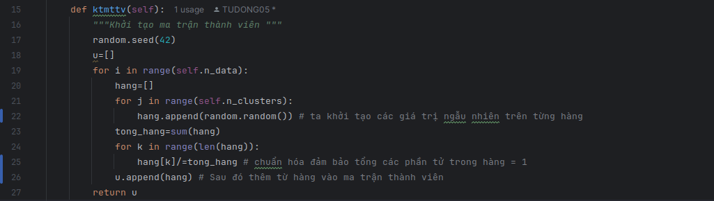
### • Hàm cập nhật tâm cụm 
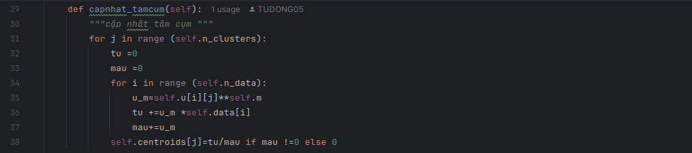
### • Hàm tính khoảng cách từ điểm dữ liệu đến tâm cụm 
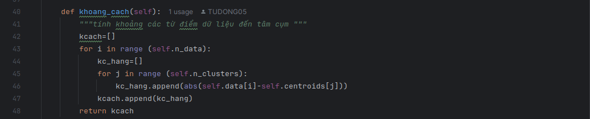
### • Hàm cập nhật ma trận thành viên 

### • Hàm tính sự chênh lệch giữa ma trận thành viên cũ và ma trận thành viên mới 
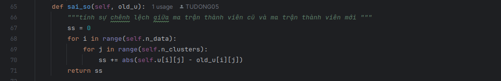
### • Hàm triển khai thuật toán Fuzzy C-Means 
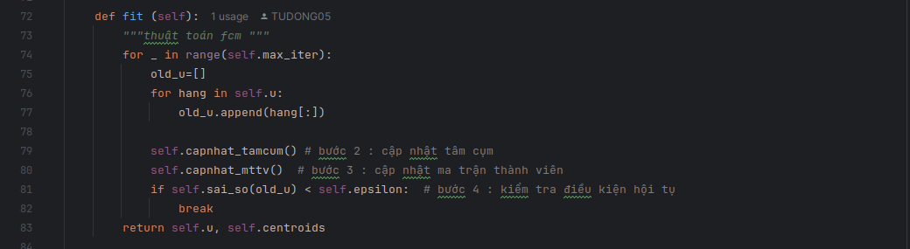
### • Truyền dữ liệu và thực hiện 
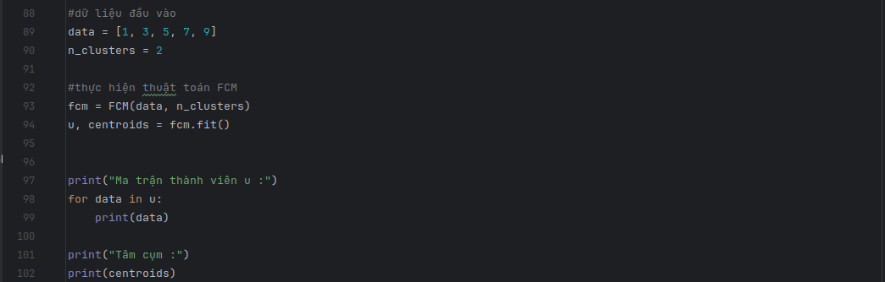
### • Kết quả thu được 

# 4. Ưu điểm của FCM:
## • Xử lý mờ: FCM phù hợp với dữ liệu không có ranh giới rõ ràng, giúp phân cụm linh hoạt hơn K-Means.
## • Thông tin bổ sung: Mức độ thành viên cung cấp thêm thông tin về mối quan hệ giữa điểm dữ liệu và các cụm.
# 5. Hạn chế của FCM
   ## • Phụ thuộc vào m: Chỉ số mờ m cần được chọn phù hợp, vì nó ảnh hưởng đến kết quả.
   ## • Nhạy cảm với điểm nhiễu: Giống K-Means, FCM dễ bị ảnh hưởng bởi các điểm dữ liệu nằm xa (outliers).
   ## • Số cụm cố định: Người dùng cần chỉ định trước số cụm C, có thể không phù hợp với dữ liệu thực tế.
# 6. Ứng dụng
## Xử lý ảnh: 
### • Phân đoạn ảnh y tế (ví dụ: tách vùng não hoặc tế bào ung thư)
### •  Nhận dạng mẫu:phân loại các đối tượng trong ảnh(ví dụ người, động vật, đồ vật, ...)

## Khai phá dữ liệu:
### • Phân tích thị trường: Phân nhóm khách hàng dựa trên hành vi mua sắm, sở thích. 
### • Phân tích văn bản: Phân loại văn bản thành các chủ đề khác nhau. 
### • Phân tích gen: Phân nhóm các gen dựa trên biểu hiện gen.
